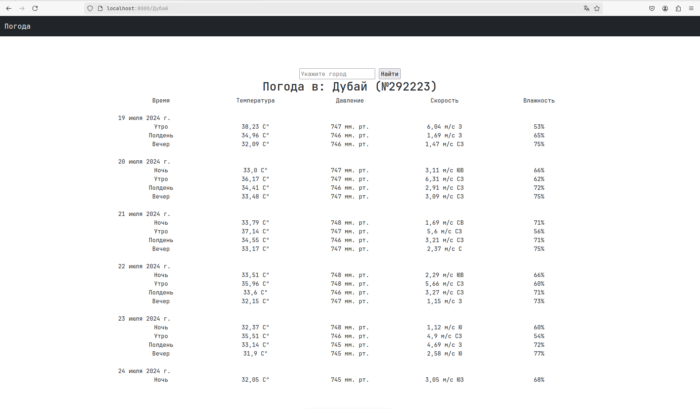
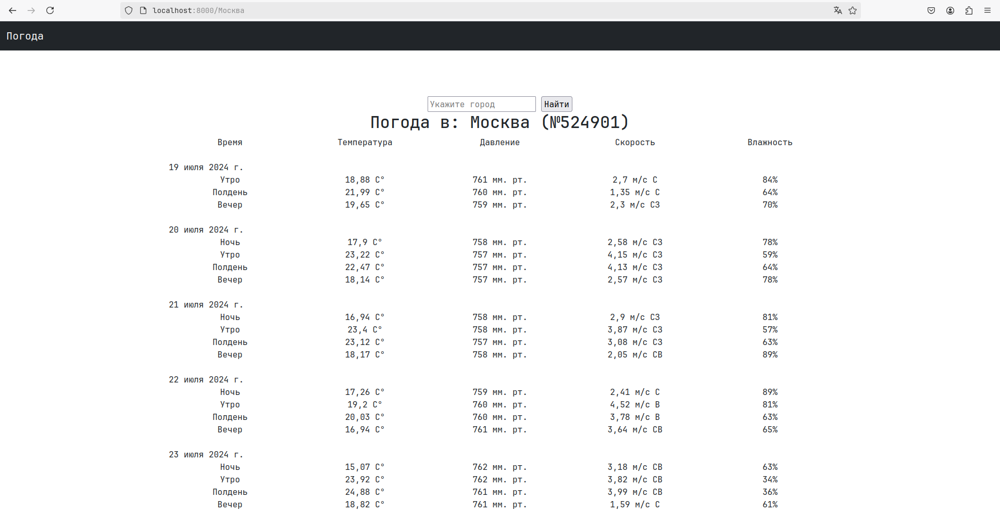

# Web приложение Погоды
##### Тестовое задание Python Developer

 - Вывод данных (прогноза погоды) должен быть в удобно читаемом формате. 
 - Веб фреймворк можно использовать любой.
 - api для погоды:* https://open-meteo.com/ *(можно использовать какое-нибудь другое, если вам удобнее)*

Дополнение:

- ~~написаны тесты~~
- всё это помещено в докер контейнер
- ~~сделаны автодополнение (подсказки) при вводе города~~
- ~~при повторном посещении сайта будет предложено посмотреть погоду в городе, в котором пользователь уже смотрел ранее~~
- ~~будет сохраняться история поиска для каждого пользователя, и будет API, показывающее сколько раз вводили какой город~~

## Как использовать

1. **Клонировать репозиторий:**

   ```bash
   git clone https://github.com/ScorP14/weather_django.git
   cd your_repository

2. **Переименовать файл .env_exemple в .env и заполнить ключ к API OpenWeatherMap.**

3. **Запустить Docker контейнер командой:**

   ```bash
   sudo docker-compose up

4. **Перейти на <http://localhost:8000>**

## Скриншоты



